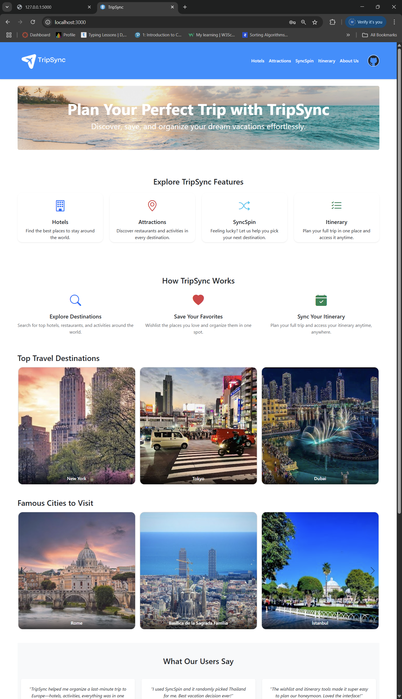
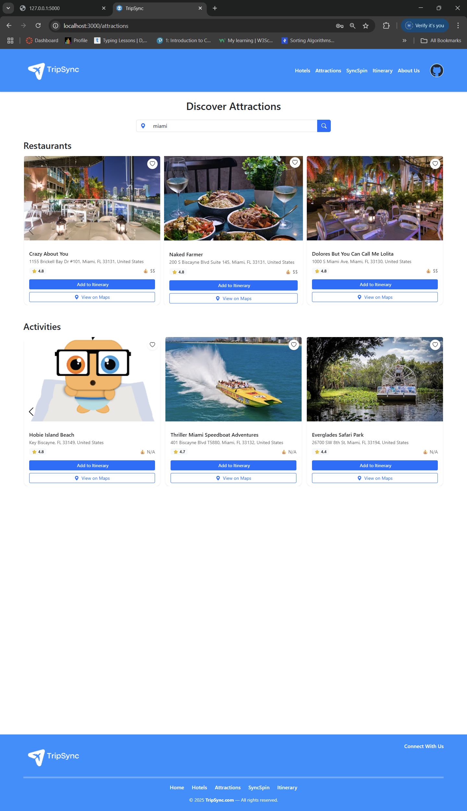
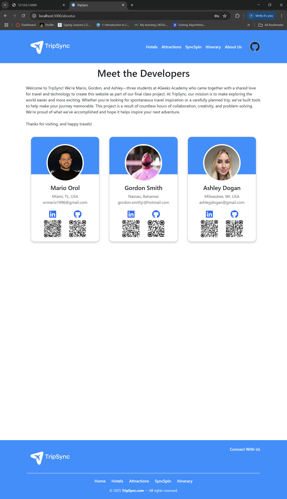

# 🌍 TripSync

**TripSync** is a full-stack travel itinerary planner that allows users to search hotels and attractions, create and share personalized itineraries, and save favorite locations—all through an interactive, user-friendly platform.

---

## 🚀 Features

- 🔐 User Authentication (JWT-based login and signup)
- 🧳 Create, edit, and delete travel itineraries
- 🏨 Hotel & attraction search powered by Google Places API
- ❤️ Add places to a personal wishlist
- 🔗 Shareable itinerary links
- 📬 Password reset via email using SendGrid
- 📱 Responsive design for mobile and desktop

---

## 🛠 Tech Stack

### Frontend

- React.js
- Context API
- Bootstrap
- Vite

### Backend

- Python Flask
- SQLAlchemy
- PostgreSQL
- Flask-Migrate
- JWT Authentication
- SendGrid (email services)
- CORS

---

## 🖥 Screenshots

```markdown




```
